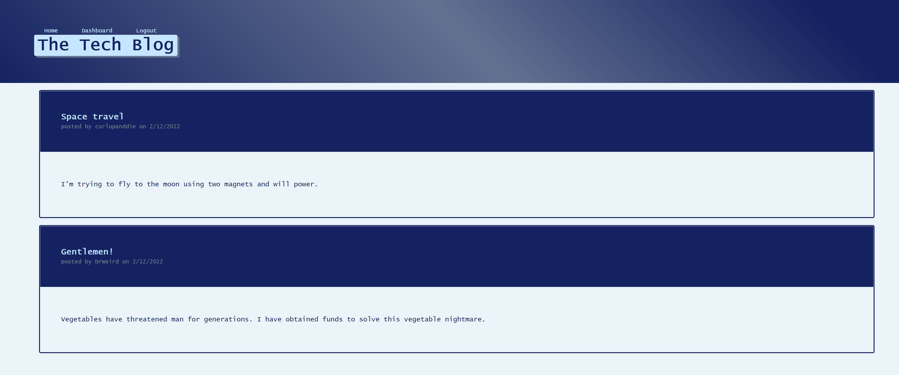

# Tech Blog
  

  ## Description
  A CMS-style blog site , where developers can publish their blog posts and comment on other developers’ posts as well. The app uses Handlebars.js as the templating language, Sequelize as the ORM, and the express-session npm package for authentication. The site is hosted by [Heroku](https://www.heroku.com), and uses [JawsDb](https://elements.heroku.com/addons/jawsdb) MySQL database.

  

  ## Table of Contents
  * [Usage](#usage)
  * [Deployment](#deployment)
  * [License](#license)
  * [Questions](#questions)

  ## Usage
  Sign up or log in to create/edit posts, and comment on others' posts. 

  ## Deployment  
  [Click here to go to site](https://walker-tech-blog.herokuapp.com/)
  ## License
 [MIT License](https://choosealicense.com/licenses/mit/)

Copyright (c) 2022 Michael Walker

Permission is hereby granted, free of charge, to any person obtaining a copy
of this software and associated documentation files (the "Software"), to deal
in the Software without restriction, including without limitation the rights
to use, copy, modify, merge, publish, distribute, sublicense, and/or sell
copies of the Software, and to permit persons to whom the Software is
furnished to do so, subject to the following conditions:

The above copyright notice and this permission notice shall be included in all
copies or substantial portions of the Software.

THE SOFTWARE IS PROVIDED "AS IS", WITHOUT WARRANTY OF ANY KIND, EXPRESS OR
IMPLIED, INCLUDING BUT NOT LIMITED TO THE WARRANTIES OF MERCHANTABILITY,
FITNESS FOR A PARTICULAR PURPOSE AND NONINFRINGEMENT. IN NO EVENT SHALL THE
AUTHORS OR COPYRIGHT HOLDERS BE LIABLE FOR ANY CLAIM, DAMAGES OR OTHER
LIABILITY, WHETHER IN AN ACTION OF CONTRACT, TORT OR OTHERWISE, ARISING FROM,
OUT OF OR IN CONNECTION WITH THE SOFTWARE OR THE USE OR OTHER DEALINGS IN THE
SOFTWARE.

  ## Questions
  My Github Profile: [michaelwwalker42](https://github.com/michaelwwalker42)  
  For additional questions email me at michaelwwalker42@gmail.com  
